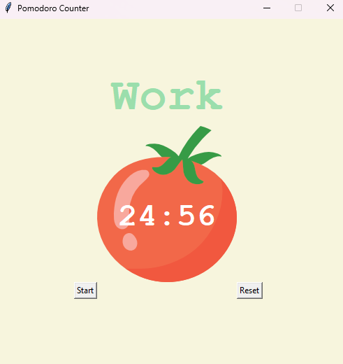

## Pomodoro Timer 🍅 -> ⏲️ 

A simple **Pomodoro Timer** written in Python using the `tkinter` library for the GUI interface.

### Features 🚀
- Intuitive **Graphical Interface** with a minimalistic design.
- Use of **Tomato Pomodoro Image** to visualize focus intervals.
- Easily customizable for **work-break cycles**.
- Lightweight and beginner-friendly.

### Preview 🖼️


### Installation 🛠️
Ensure Python is installed on your system. Clone the repository:
```bash
git clone https://github.com/AenuHub/pomodoro.git
cd pomodoro
```

### Dependencies
- Python 3.x
- tkinter (built into Python standard library)

### Usage ▶️
Run the timer by executing the script:
```bash
python main.py
```

### Contribution 🤝
Feel free to fork this repository and add new features, fix bugs, or improve the UI!
